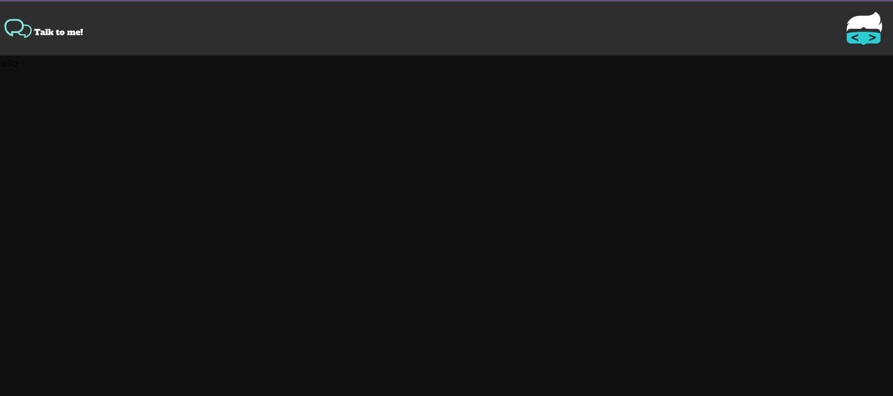
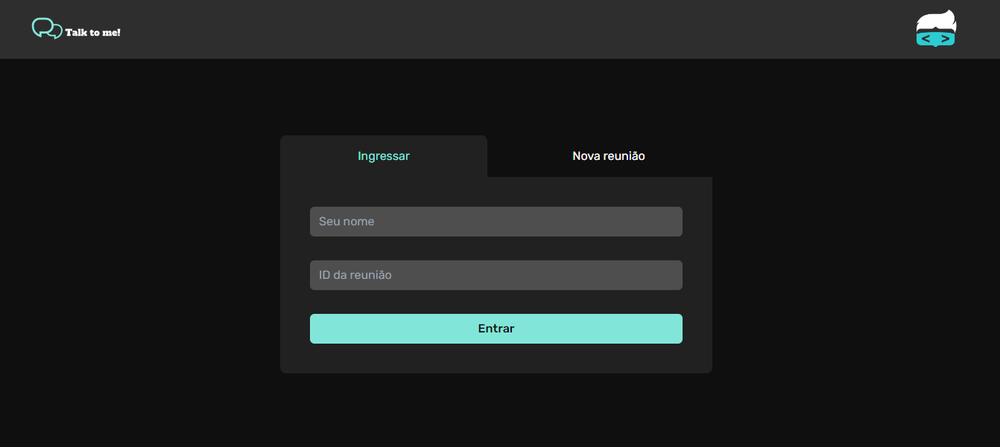
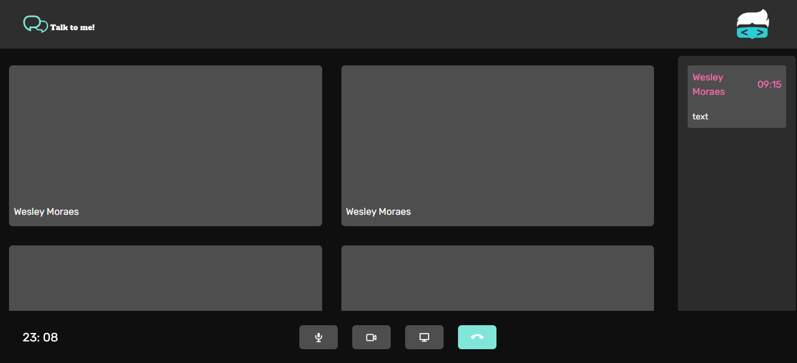
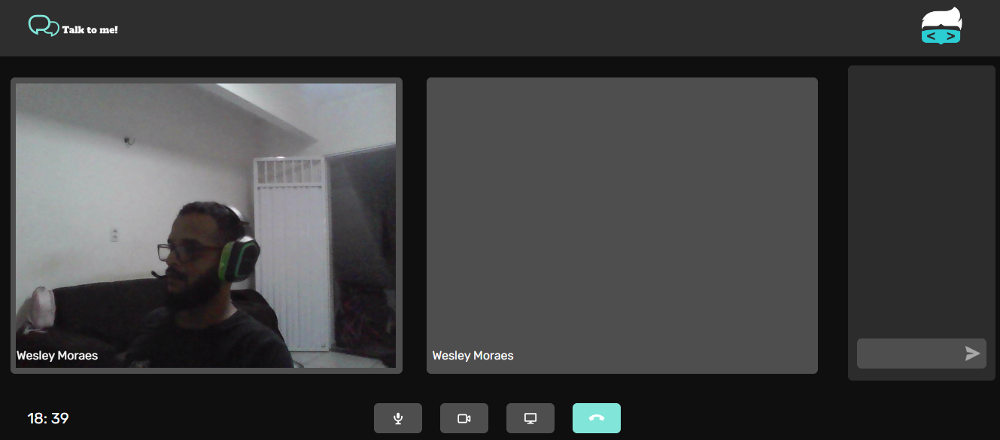
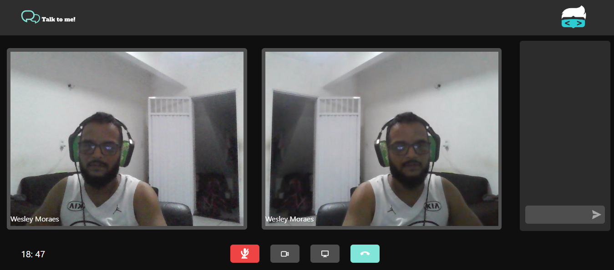

# Projeto Google Meet Replicado

## Sobre Mim
Olá, sou Wesley Moraes, um entusiasta de tecnologia e desenvolvedor de software FullStack. Meu interesse aprimorar interfaces web me levaram a embarcar neste projeto de construção de um site de
venda de bicicletas elétricas, onde serão aplicados todas técnicas e boas práticas.

## Informações Técnicas Do Desenvolvedor:

- **HTML:** Linguagem fundamental para estruturar páginas web.
- **CSS:** Utilizado para estilizar e dar vida às minhas criações.
- **Tailwind:** Utilizado para otimizar meus projetos com react.
- **JavaScript:** Utilizado em projetos pessoais.
- **Typescript:** Utilizado em todos os projetos que eu faço usando react ou next.
- **React:** Utilizado para criar projetos frontend complexos.
- **NextJs-13:** Utilizado para projetos frontEnd robustos.
- **Java:** Utilizado em ambiente de estudos.
- **C#:** Utilizado em projetos pessoais e profissionais .
- **.Net6:** Utilizado em projetos pessoais e profissionais.
- **Springboot:** Utilizado em ambiente de estudos.

## Visão Geral

Este projeto é uma replicação do Google Meet, uma plataforma de videoconferência online, desenvolvida utilizando Next.js no frontend. O objetivo é criar uma experiência completa de comunicação, incluindo áudio, chat e vídeo, para facilitar reuniões virtuais e colaboração online.

## Tecnologias Utilizadas

- **Next.js:** Framework React para construção de aplicações web modernas.
- **WebRTC:** Para comunicação em tempo real de áudio e vídeo.
- **Socket.io:** Para comunicação em tempo real para o recurso de chat.

## Funcionalidades Principais

1. **Vídeo Conferência:**
   - Integração do WebRTC para permitir chamadas de vídeo entre os participantes.
   - Controle de câmera e microfone durante a chamada.
   - Compartilhamento de tela.
   - Interrupção da chamada.

2. **Chat em Tempo Real:**
   - Utilização do Socket.io para fornecer um recurso de chat em tempo real.
   - Mensagens de texto entre os participantes da reunião.
   - 
3. **Express:**
   - Utilizado como servidor.
   - 
4. **Stun Server:**
   - Utilizado para a comunicação P2P, é usado como um servidor.

5. **Áudio Conferência:**
   - Implementação de funcionalidade de áudio para comunicação durante a reunião.
   - Controles de áudio, como mudo e volume.
   - 
6. **Links Importantes:**
   - [Socket.io](https://socket.io/)
   - [WebRTC](https://webrtc.org/?hl=pt-br)

## Progresso do Projeto

### Versão Atual: 
Nesta versão do projeto, estabeleci apenas o header da página.

### Versão Atual: 
Nesta versão do projeto, é estabelicido a pagina de inicio do chat.

### Versão Atual: 
Nesta versão do projeto, é estabelido o ingresso para uma nova reunião.

### Versão Atual: 
Nesta versão do projeto, sala de bate papo.

### Versão Atual: 
Nesta versão do projeto, Ativição da primeira camera para o bate papo.

### Versão Atual: 
Nesta versão do projeto, é finalizado a interação do chat com duas pessoas na sala e funcionalidades dos botões no footer de interação de mídias: microfone, câmera e compartilhamento de tela, porém alguns bugs precisam serem corrigidos. Já existe a ativivação de duas câmeras. Para a tela inicial ainda é necessário retirar alguns nomes mocados assim como a permissão de usuários novos pelo id da sala.

